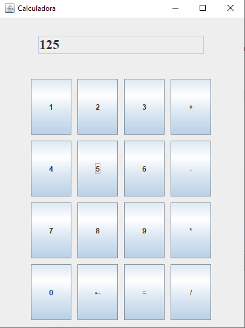

# Calculadora Java
 É uma calculadora escrita em java usando orientação a objetos como fundamentação do código e java Swing para a interface gráfica.
#

# Autor
Thalyson [GitHub](https://github.com/nooneknowws)
